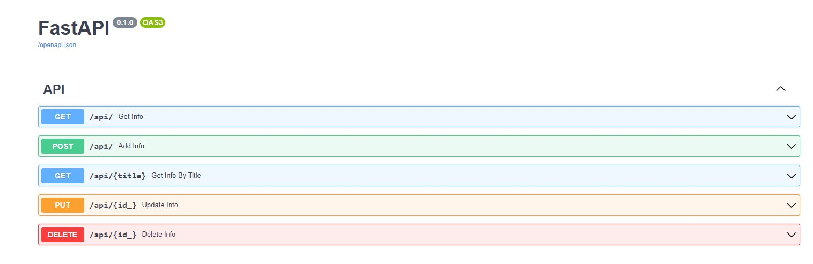
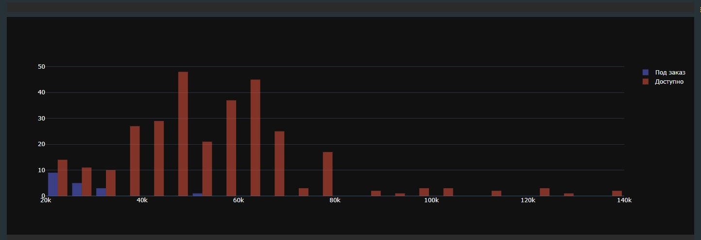
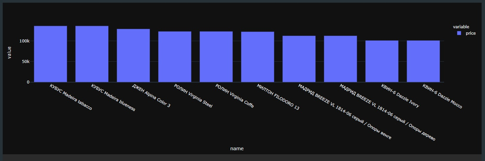
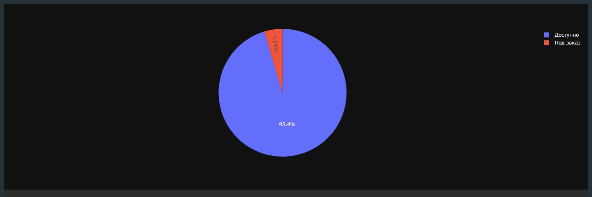

### REST API, CRUD, парсер для заполнения БД, визуализация данных в виде графиков и диаграмм
#### Стек: FastAPI, Ormar, Alembic, BS4, Pandas, Plotly, Docker
* Клонировать репозиторий
```
git clone https://github.com/Cpt-Potato/azbykamebeli.git
```
* Перейти в папку с проектом
* Построить контейнеры докера и запустить их, БД заполнится данными из дампа (чтобы не запускать парсер каждый раз)
```
docker-compose up -d
```
* Перейти на [127.0.0.1:8000/docs](127.0.0.1:8000/docs)
* Для визуализации данных экспортировать данные из БД в CSV (PyCharm легко справляется с этим), открыть "visualization.ipynb" и запустить все строки, тогда данные сохранятся в html-страницы; 
или же можно их увидеть прямо в этом блокноте





